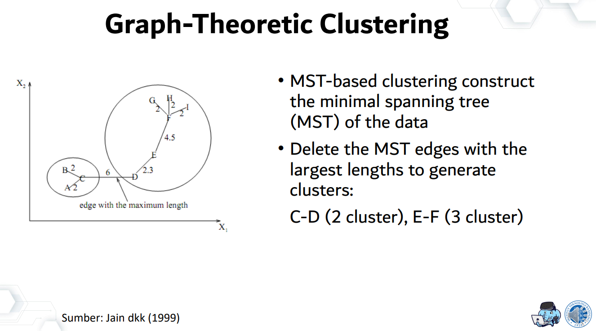

# MST-Based Clustering

Versi **24 Juni 2022**

Changelog:
- Batasan algoritma MST-Kruskal di spek wajib
- Analisis kompleksitas algoritma di readme
- Spesifikasi docker di spek wajib
- Cara menjalankan aplikasi di readme
- Perhatikan pemilihan struktur data serta implementasi algoritma

## Latar Belakang

MST-Based Clustering merupakan salah satu algoritma unsupervised pada machine learning yang banyak digunakan. Jika diberikan sebuah dataset dengan n buah titik random, algoritma ini akan membangun sebuah Minimum Spanning Tree (MST), kemudian melakukan pengelompokkan data dengan cara memotong sisi MST mulai dari sisi dengan bobot terbesar. Jumlah sisi yang dipotong menentukan jumlah cluster yang akan dibuat, untuk setiap n cluster akan ada n-1 pemotongan sisi mulai dari sisi dengan bobot terbesar.

Pada tugas ini, kalian akan diminta untuk membuat suatu website yang dapat menyelesaikan permasalahan MST-Based Clustering dengan menggunakan algoritma Kruskal serta menampilkan hasil visualisasinya.

  

 
**Fig 1.** Contoh Clustering
 

 
**Fig 2.** Algoritma MST-Based Clustering
 

## Spesifikasi Wajib (2250 poin)

1. Aplikasi berbasis **website** dengan pembagian **Frontend** dan **Backend** yang jelas, wajib dibuat pada repository GitHub yang terpisah.
2. Implementasi Backend wajib menggunakan **Golang**, sedangkan Frontend wajib menggunakan **React TypeScript**, wajib mengimplementasikan **Clean Architecture**.
3. Aplikasi dapat menerima input data dari pengguna berupa **file** dengan format **.csv** serta **jumlah** Cluster yang diinginkan.
   - Template file input dapat diunduh [disini](https://docs.google.com/spreadsheets/d/1FHKvnb7KbQaX8aEFsx9fMyq8OHLKtHJRV4kjFYcApYg/edit?usp=sharing).
4. Aplikasi dapat memproses input data kemudian membaginya ke dalam Cluster yang sesuai dengan menggunakan algoritma **Kruskal** yang diimplementasikan pada sisi **Backend**.
5. Batasan Algoritma MST-Kruskal:
   - `Time limit: 1 second`
   - `0 < N <= 1000, N: jumlah data`
   - Pertimbangkan pemilihan struktur data serta implementasi algoritma agar kompleksitasnya tidak melebihi batasan yang disediakan.
6. Aplikasi dapat menyimpan hasil Clustering pada **basis data** (MySQL / PostgreSQL / MongoDB).
7. Aplikasi dapat menampilkan **visualisasi** data hasil Clustering pada koordinat kartesius.
   - Data untuk tiap Cluster wajib divisualisasikan dengan warna yang berbeda.
   - Framework untuk visualisasi data dibebaskan.
8. Aplikasi dapat menampilkan **Log** atau Riwayat hasil Clustering, masing-masing data pada Log ketika di-klik dapat menampilkan hasil visualisasi Cluster-nya.
9. Aplikasi dapat dijalankan dengan menggunakan **Docker** pada lokal komputer baik untuk Frontend, Backend, maupun Basis Data.
   - Buatlah Dockerfile masing-masing untuk Frontend dan Backend agar dapat membuat image pada container.
   - Buatlah script docker-compose pada repository Backend untuk menjalankan container Backend dan Basis Data.
   - Buatlah script docker-compose pada repository Frontend untuk menjalankan container Frontend.
   - Aplikasi pada masing-masing repository dapat dijalankan hanya dengan command `docker-compose up -d`.
   - Pastikan migrasi basis data dapat berlangsung ketika aplikasi dijalankan.
10. Buatlah readme pada masing-masing repository yang menjelaskan:
    1. Deskripsi Program
    2. Teknologi dan Framework 
    3. (Backend) Penjelasan Algoritma Kruskal 
    4. (Backend) Analisis Kompleksitas Algoritma, nyatakan kesimpulannya dalam notasi big O 
    5. (Frontend) Screenshot Hasil Percobaan 
    6. Cara menjalankan aplikasi (`docker-compose up -d`)
    7. Referensi Belajar

## Spesifikasi Bonus (750 poin)

Note: _Sebelum mengerjakan bonus, pastikan Anda sudah memenuhi spesifikasi wajib._

1. **(250 poin)** Aplikasi dapat menampilkan langkah-langkah penyelesaian MST-based Clustering dengan algoritma Kruskal.
2. **(500 poin)** Melakukan deployment aplikasi menggunakan CI/CD GitHub Action.
   - Wajib mengimplementasikan unit test Golang untuk algoritma kruskal.
   - Buat script CI/CD untuk menjalankan unit test serta deployment.

## Pengerjaan dan Pengumpulan

1. Buatlah repository private pada Github, Frontend dan Backend dibuat pada repository yang berbeda, invite `cjustinw` ke dalam repository tersebut.
2. Buatlah issue di dalam repository ini untuk bertanya.
3. Untuk pengumpulan dapat mengisi [form ini](https://forms.gle/CxGBkHJpvZKQ6sBq6) kemudian menghubungi line @christjw untuk menjadwalkan demo.
4. Urutan pengumpulan akan dilihat berdasarkan jadwal demo.
